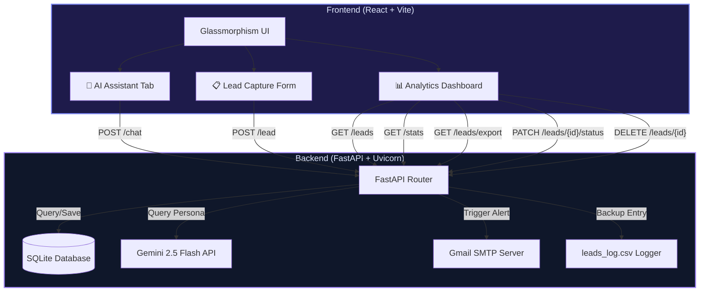

# 🤖 AI-Powered Business Automation Assistant
An elegant, premium, dark-themed AI Business Automation Assistant built for **Codenixia**. This application features a highly responsive **FastAPI** backend integrated with the **Google GenAI SDK (Gemini 2.5 Flash)** and a modern **React (Vite)** frontend styled using a state-of-the-art **glassmorphism dark UI**.
This system streamlines lead acquisition, automates backend notification systems (real-time SMTP email notifications and CSV backups), and provides an analytics dashboard for tracking and managing business leads.
---
## 🏗️ Architecture Overview

---
## ✨ Features
### 1. 🤖 AI Business Chatbot (`/chat`)
* **Engaging Chat Interface**: Conversational bubble-style UI with automatic scrolling, loading states, and typing indicators.
* **Codenixia Persona Guidance**: Configured with a rich system instruction to guide users professionally regarding AI/ML, Data Science, Full-Stack Development, Cloud Computing, DevOps, and automation programs.
* **Powered by Gemini 2.5 Flash**: Fast, coherent, and highly smart replies using the modern Google GenAI SDK.
* **Starter Questions**: Tap-to-submit suggestions to jumpstart user conversations.
### 2. 📋 Smart Lead Capture (`/lead`)
* **Premium Form Design**: Modern floating labels, animated focus rings, validation badges, and response feedback.
* **Client-Side Validation**: Robust client-side checks for names, phone numbers, and emails before sending API calls.
* **Dual Workflows**: Upon lead submission:
  * **Real-time SQLite Storage**: Recorded securely in the local SQLite database.
  * **Automatic CSV Backups**: The entry is appended immediately to `leads_log.csv` with chronological ISO timestamps.
  * **HTML Rich Email Alerts**: Generates a visually beautiful HTML email, complete with rounded glass cards and matching gradients, dispatched to the administrator via secure Gmail SMTP.
### 3. 📊 Interactive Analytics Dashboard (`/leads` & `/stats`)
* **Executive Metrics**: Tracks *Total Leads*, *Leads Today*, *Weekly Growth*, and *Conversion Rate* in real-time.
* **Dynamic Lead List**: Filterable and sortable interactive table with status pill badges (`new`, `contacted`, `converted`).
* **Instant Lifecycle Updates**: Toggle statuses inside the list to smoothly track lead stages.
* **CSV Export Tool**: One-click download streaming all database records as a well-formed CSV file.
* **Delete Action**: Cleanly purge entries from the SQLite DB.
---
## 🛠️ Technology Stack
### Backend
* **FastAPI**: Modern, high-performance web framework for Python.
* **SQLAlchemy & SQLite**: Robust Object-Relational Mapper coupled with a lightweight, file-based SQL database.
* **Google GenAI SDK**: Advanced integration leveraging `gemini-2.5-flash` for business-consulting capabilities.
* **SMTP (smtplib & email)**: Integrated secure SMTP client with MIME support for rich HTML email delivery.
* **Pydantic**: Structural data validation and type enforcement.
* **Python-dotenv**: Secure environment management.
### Frontend
* **React + Vite**: Highly optimized single-page web environment featuring Hot Module Replacement (HMR).
* **Vanilla CSS**: Bespoke design system utilizing custom variables, premium CSS backdrop filters for glassmorphism, responsive grid systems, and buttery-smooth state transitions. No massive third-party styling bundles required.
---
## 🔌 API Reference
### Health & Monitoring
* **`GET /`**
  * *Description*: Confirms service status and configuration.
  * *Response*:
    ```json
    {
      "status": "running",
      "service": "AI Business Automation Assistant",
      "version": "1.0.0",
      "timestamp": "2026-05-21T22:03:35.000Z"
    }
    ```
### Chat Interface
* **`POST /chat`**
  * *Description*: Generates a domain-specific reply based on the Codenixia knowledge base.
  * *Request Body*:
    ```json
    {
      "message": "What courses do you offer in AI?"
    }
    ```
  * *Response*:
    ```json
    {
      "reply": "Codenixia offers state-of-the-art AI/ML and automation programs..."
    }
    ```
### Lead Management
* **`POST /lead`**
  * *Description*: Validates and stores a new customer inquiry, launching logging and SMTP triggers.
  * *Request Body*:
    ```json
    {
      "name": "Jane Doe",
      "email": "jane@example.com",
      "phone": "+1234567890",
      "message": "Interested in AI consulting."
    }
    ```
* **`GET /leads`**
  * *Description*: Retrieves all leads in descending order of creation.
* **`PATCH /leads/{lead_id}/status`**
  * *Description*: Updates lead lifecycle status.
  * *Request Body*:
    ```json
    {
      "status": "contacted"
    }
    ```
* **`DELETE /leads/{lead_id}`**
  * *Description*: Removes a lead entry permanently from the SQLite DB.
* **`GET /leads/export`**
  * *Description*: Exports all records as a downloadable CSV attachment.
* **`GET /stats`**
  * *Description*: Returns dashboard KPI overview figures (conversions, daily submissions, status aggregates).
---
## ⚙️ Local Development Setup
### 1. Prerequisites
Ensure you have the following installed on your machine:
* **Python 3.10+**
* **Node.js 18+** & **npm**
### 2. Backend Setup
1. Open your terminal and navigate to the backend directory:
   ```bash
   cd backend
   ```
2. Create and activate a Python virtual environment:
   ```bash
   # Windows
   python -m venv venv
   .\venv\Scripts\activate
   # macOS/Linux
   python3 -m venv venv
   source venv/bin/activate
   ```
3. Install the required libraries:
   ```bash
   pip install -r requirements.txt
   ```
4. Verify or create your `.env` configuration file in the `backend/` directory:
   ```env
   GEMINI_API_KEY=your_gemini_api_key_here
   SMTP_EMAIL=your_gmail_address_here
   SMTP_PASSWORD=your_gmail_app_password_here
   ```
   > [!NOTE]
   > For email notifications to work, you must use a Gmail address with an **App Password** created via Google Account security settings (2-Factor Authentication must be enabled).
5. Start the FastAPI development server:
   ```bash
   uvicorn main:app --reload
   ```
   The backend will be available at `http://localhost:8000`. You can inspect the interactive OpenAPI documentation at `http://localhost:8000/docs`.
### 3. Frontend Setup
1. In a new terminal window, navigate to the frontend directory:
   ```bash
   cd frontend
   ```
2. Install all node packages:
   ```bash
   npm install
   ```
3. Boot up the Vite dev server:
   ```bash
   npm run dev
   ```
   The application will launch automatically on your local host, typically at `http://localhost:5173`.
---
## 🚀 Deployment Guide
### Backend (Render)
1. **GitHub Repository**: Initialize a Git repository and push the codebase to GitHub.
2. **Create Web Service**: Set up a new Web Service on [Render](https://render.com) pointing to your repo.
3. **Configure Service Details**:
   * **Environment**: `Python`
   * **Root Directory**: `backend`
   * **Build Command**: `pip install -r requirements.txt`
   * **Start Command**: `uvicorn main:app --host 0.0.0.0 --port $PORT`
4. **Environment Variables**: Define `GEMINI_API_KEY`, `SMTP_EMAIL`, and `SMTP_PASSWORD` in your Render Environment settings.
### Frontend (Vercel)
1. **Create Project**: Set up a new project on [Vercel](https://vercel.com) connecting to the same Git repository.
2. **Configure Settings**:
   * **Root Directory**: `frontend`
   * **Framework Preset**: `Vite`
   * **Build Command**: `npm run build`
   * **Output Directory**: `dist`
3. **SPA Routing**: The `frontend/vercel.json` already contains custom rules to route all incoming traffic correctly, preventing broken refreshes.
---
Developed by **Pratik Patil** for the **Codenixia AI Internship Assessment 2026**.
